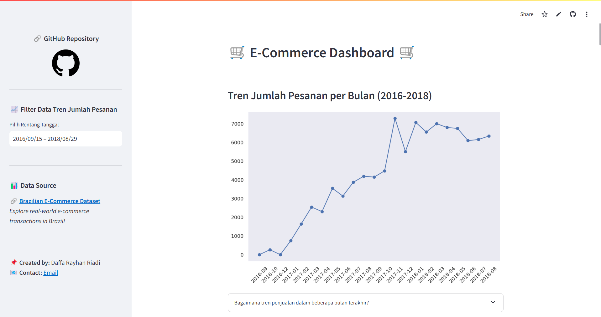

# 📊 Proyek Analisis Data dengan Python: E-Commerce Dashboard

Selamat datang di proyek **E-Commerce Dashboard**! 🚀
Dashboard ini dibuat menggunakan **Python** dan **Streamlit** untuk menganalisis dan memvisualisasikan data transaksi e-commerce.

🔗 **Lihat Dashboard Live:** [Klik di sini](https://daffa-ecommerce-data-analysis.streamlit.app/)

---

## 📸 Screenshot Dashboard


---

## 🛠️ Setup Proyek
Ikuti langkah-langkah berikut untuk menjalankan proyek:

### 1️⃣ Clone Repository
```sh
 git clone https://github.com/daffarayhanriadi/ecommerce-data-analysis.git
```

### 2️⃣ Masuk ke Direktori Proyek
```sh
 cd ecommerce-data-analysis
```

### 3️⃣ Buat Virtual Environment
#### 🔹 Windows
```sh
 python -m venv my_venv
```

#### 🔹 macOS/Linux
```sh
 python3 -m venv my_venv
```

### 4️⃣ Aktifkan Virtual Environment
#### 🔹 Windows
```sh
 my_venv\Scripts\activate
```
#### 🔹 macOS/Linux
```sh
 source my_venv/bin/activate
```

### 5️⃣ Install Dependencies
```sh
 pip install -r requirements.txt
```

### 6️⃣ Jalankan Aplikasi Streamlit
```sh
 streamlit run dashboard/dashboard.py
```

### 7️⃣ (Opsional) Nonaktifkan Virtual Environment
```sh
 deactivate
```

---

## 📚 Referensi Dataset
Dataset yang digunakan dalam proyek ini berasal dari **Brazilian E-Commerce Public Dataset**.

🔗 **Download Dataset:** [Klik di sini](https://drive.google.com/file/d/1MsAjPM7oKtVfJL_wRp1qmCajtSG1mdcK/view?usp=sharing)
